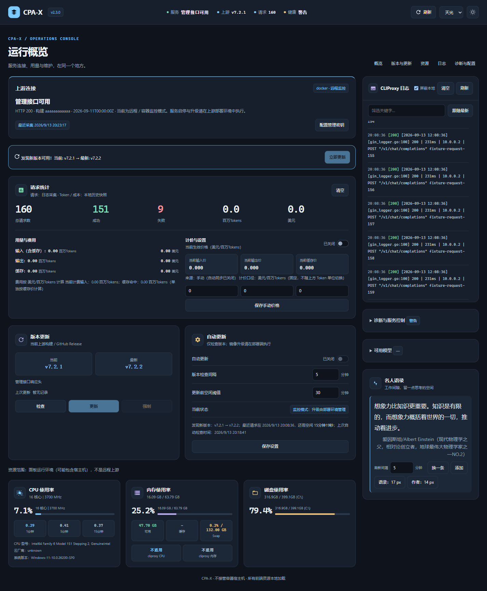
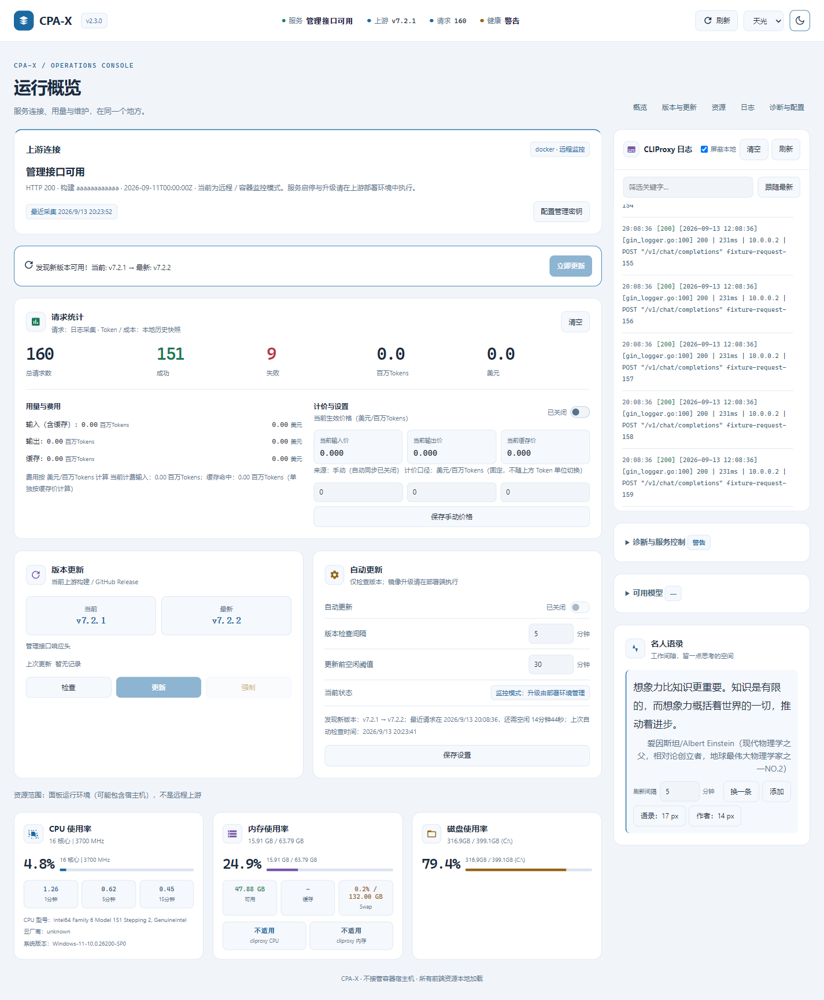
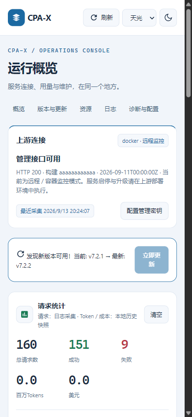

# CLIProxyAPI dashboard

[中文](README.md) · English

View [CLIProxyAPI](https://github.com/router-for-me/CLIProxyAPI) service status and request logs in a browser, and manage service upgrades. CPA-X is a companion dashboard for an existing installation.

**Requirements:** An existing CLIProxyAPI installation, Python 3.11+, and its management key. Service control and auto-update require Linux with systemd; Windows and Docker mainly support monitoring and viewing.

[Install](#running-it) · [Operations guide](OPERATIONS.md) · [Screenshots](#interface)

Live request counts come from logs. Token and cost data come from existing local history snapshots; current CLIProxyAPI versions no longer provide the legacy usage API. v2.3 serves background snapshots and explicitly separates Docker/remote monitoring from host service control.

## Interface

| Dark | Light |
|---|---|
|  |  |

Screenshots use a local simulated upstream, not production service or benchmark data.

<p align="center">
  
</p>

## What it does

- **Status** — whether the service is up, CPU / memory / disk, current upstream build vs. latest release, and connection diagnostics.
- **Usage and cost** — live request volume comes from logs. Existing token and cost history is read from local compatibility snapshots, with historical totals in the dashboard. Estimated pricing can auto-sync from OpenRouter or be entered manually with sync turned off.
- **Logs** — incrementally parsed, with error highlighting and keyword filtering, so you don't SSH in to `tail`.
- **Upgrades** — check, download, verify, replace, restart, health-confirm, and roll back on failure.
- **Service control** — start, stop, and restart the systemd unit on Linux. Under Windows and Docker this is explicitly disabled rather than silently pretending to work.
- **Config** — read-only and validate-only by default. Writing back to the main config is something you have to turn on yourself.
- **Themes** — Sky, Mint, Rose, and Sand light palettes plus a blue-gray dark mode, switchable from the top right and remembered. Phone layouts are fully usable, not merely reachable.

## Running it

Requires Python 3.11+ and access to the CLIProxyAPI management endpoint (default `http://127.0.0.1:8317`). **Linux is recommended** — service control and auto-update depend on systemd.

```bash
# Linux: install and register the systemd unit
bash scripts/install.sh

# Let it detect CLIProxyAPI's directory, log path, and port, and write .env
python3 scripts/doctor.py --write-env
```

Windows:

```powershell
powershell -ExecutionPolicy Bypass -File scripts/install.ps1
```

Then open `http://127.0.0.1:8080`.

Manual installation, Docker Compose, reverse proxies, the full environment-variable reference, and troubleshooting live in the [operations guide](OPERATIONS.md).

<details>
<summary>Manual installation</summary>

<br />

```bash
git clone https://github.com/ferretgeek/cliproxyapi-dashboard.git
cd cliproxyapi-dashboard

python -m venv .venv
source .venv/bin/activate          # Windows: .venv\Scripts\activate
python -m pip install --upgrade "pip>=26.1.2"
python -m pip install -r requirements.txt

cp .env.example .env               # Windows: copy .env.example .env
# Edit .env — at minimum, point it at CLIProxyAPI's directory, log file, and management endpoint

python app.py
```

Key variables (all documented inline in `.env.example`):

| Variable | Purpose |
|---|---|
| `CLIPROXY_PANEL_CLIPROXY_DIR` / `_CONFIG` / `_LOG` | Where CLIProxyAPI is installed, configured, and logging |
| `CLIPROXY_PANEL_CLIPROXY_API_BASE` / `_API_PORT` | Management endpoint address and port |
| `CLIPROXY_PANEL_MANAGEMENT_KEY` / `_MODELS_API_KEY` | Needed when upstream keys are enabled |
| `CLIPROXY_PANEL_CLIPROXY_SERVICE` / `_BINARY` | Required for auto-update to know the unit and binary |
| `CLIPROXY_PANEL_LOG_TIMEZONE` | Defaults to `auto`; also accepts `UTC`, `+08:00`, or `Asia/Shanghai` |
| `CLIPROXY_PANEL_PANEL_ACCESS_KEY` | **Required** for any non-loopback bind, minimum 32 characters |
| `CLIPROXY_PANEL_CONFIG_WRITE_ENABLED` | Defaults to `false`; only enable main-config writeback if you accept the risk |

</details>

<details>
<summary>Docker (good for monitoring and read-only operations)</summary>

<br />

Containers usually lack systemd and host privileges, so **auto-update and service control are unavailable under Docker**. Monitoring uses the reachable management API; logs and config reads require read-only mounts. Compose passes upstream keys and API addresses and persists panel settings in `data/`. Version discovery still works with upgrades disabled; an upstream `dev` build is shown honestly as a development build.

```bash
cp .env.docker.example .env.docker
# Generate a random value of at least 32 characters for CLIPROXY_PANEL_PANEL_ACCESS_KEY
docker compose --env-file .env.docker up -d --build
```

Compose publishes the host port on `127.0.0.1` by default and refuses to start with an empty access key. For remote access, keep the loopback publication and put a TLS reverse proxy in front. Never expose the container port directly to the internet.

</details>

## Worth noting technically

**Upgrades can't report a fake success.** This is the part that got the most attention, prompted by an intermittent `502` in production. The flow is now: prepare online → verify SHA-256 → atomic replacement → restart → **actually call the authenticated management endpoint and require HTTP 200** before declaring success. A failed version enters durable exponential backoff that survives a panel restart, and rolls back to the last known-good build. Anonymous GitHub version checks prefer stable release redirects to avoid tripping rate limits.

**Logs are parsed incrementally.** A bounded incremental scan avoids re-reading the entire file on every refresh, with per-cycle byte/time budgets and bounded tail reads. State is persisted with atomic writes, upstream outages back off and retry, and backups are capped by count, age, and size.

**Time zones are inferred, not guessed.** CLIProxyAPI log timestamps may carry no offset, and host and container zones can disagree. The panel reconstructs the correct instant, emits UTC / RFC 3339 from every API, and renders in whichever zone you configure.

**Dangerous entry points are closed by default.** All frontend export entries were removed so sensitive data can't leak through a browser download link. Main-config writeback is off. Cross-origin API access is off. Loopback mode accepts only literal localhost/loopback `Host` values and rejects cross-site mutations. The Linux installer runs systemd from a root-owned snapshot under `/opt/cliproxy-panel/releases/`.

**There's a deployment guide written for AI agents.** [`AI_DEPLOY_CN.md`](AI_DEPLOY_CN.md) and [`AGENTS.md`](AGENTS.md) spell out directory conventions, environment variables, verification commands, and failure handling as executable steps, so you can hand the install to Claude Code or Codex. Human deployment is the three commands above — both paths are complete.

## What it doesn't do

- It isn't a replacement for or distribution of CLIProxyAPI. You install that yourself first.
- It never proxies, rewrites, or records the content of your model requests. It only reads logs and the management API.
- It doesn't create accounts and doesn't bypass any usage limit.
- No service control or auto-update on Windows or Docker (both need systemd). The UI disables those actions explicitly instead of failing silently.

## FAQ

**The page loads but there's no data.** Check that CLIProxyAPI is running, then verify `CLIPROXY_PANEL_CLIPROXY_API_BASE` / `_PORT` in `.env`.

> Current CLIProxyAPI releases no longer expose the legacy usage management endpoints. CPA-X no longer polls them: live request totals come from incremental log parsing, and token/cost history stored before the upgrade remains readable from local compatibility snapshots without repeated upstream `404`s.

**Health check times out.** Use the unauthenticated, minimal `/api/healthz` for container and load-balancer liveness probes. `/api/health` is full diagnostics and deliberately heavier.

**systemd features do nothing.** That's a Linux-only capability. On Windows it fails gracefully without affecting panel startup.

## Security notes

- **Never commit `.env`** (already in `.gitignore`). Management and model keys belong only there.
- The default bind is `127.0.0.1`. Any non-loopback bind also requires `CLIPROXY_PANEL_PANEL_ACCESS_KEY` with at least 32 characters, or the process refuses to start.
- With an access key set, `/api/*` accepts only the `X-Panel-Key` header. One-time browser setup uses the non-transmitted `#panel_key=...` fragment, never a query parameter.
- For public deployment, keep the loopback bind and terminate TLS in a reverse proxy.

## Development

```bash
python -m pip install -r requirements-dev.txt
python -m pytest
ruff check --select E9,F63,F7,F82 app.py scripts tests
```

## More documentation

[Operations](OPERATIONS.md) · [Changelog](CHANGELOG.md) · [Contributing](CONTRIBUTING.md) · [Security policy](SECURITY.md) · [Support](SUPPORT.md) · [Code of conduct](CODE_OF_CONDUCT.md) · [Report an issue](https://github.com/ferretgeek/cliproxyapi-dashboard/issues/new/choose) · [Discussions](https://github.com/ferretgeek/cliproxyapi-dashboard/discussions)

## License and disclaimer

MIT License — see [`LICENSE`](LICENSE).

This is an independent community project with no affiliation with, authorization from, or endorsement by OpenAI, Anthropic, Google, or the upstream CLIProxyAPI project, and it does not bypass any usage limit. All trademarks belong to their respective owners.
